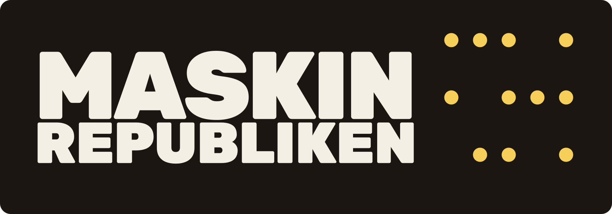

# *Ny teknik för det allmänna*

Namnet kommer av *res publica*, det allmänna. Digitala verktyg för det gemensamma är verktyg som den som använder dem också *äger*: koden går att läsa, data går att ta med sig, och driften går att flytta till någon annan. Vi bygger dem små och långlivade, eftersom det som ska bära gemensam verksamhet måste gå att underhålla av andra än oss.

## Så arbetar vi

- Drift i Sverige eller EU.
- Vi använder alltid öppna dataformat och möjliggör full dataexport.
- En Exit-plan ingår i varje avtal, ingen inlåsning i dyra system.
- Alltid öppen källkod där det går.
